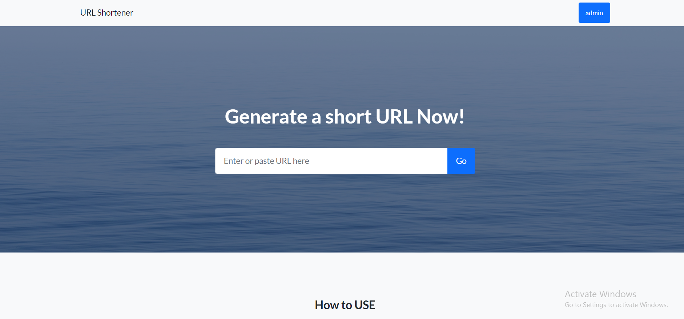
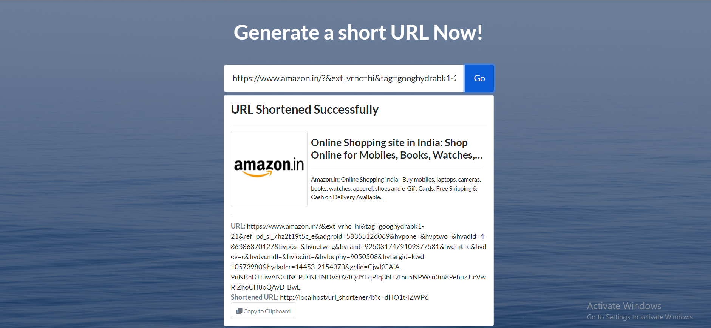
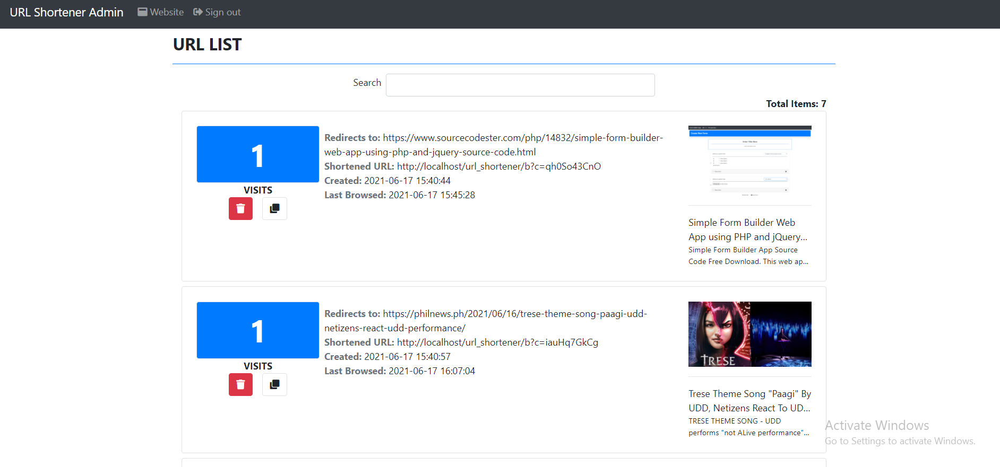

"# url-shortner" 

URL SHORTENER :- URL shortening is a technique on the World Wide Web in which a Uniform Resource Locator may be made substantially shorter and still direct to the required page. This is achieved by using a redirect which links to the web page that has a long URL.

One short link, infinite possibilities.
A short link is a powerful marketing tool when you use it carefully. It is not just a link but a medium between your customer and their destination. A short link allows you to collect so much data about your customers and their behaviors.

